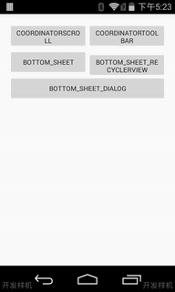
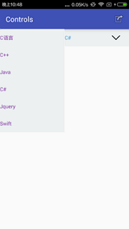
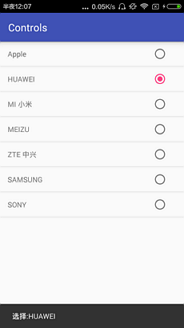

## AndroidTrain说明

### materialdesign 

符合materialdesign的页面效果

**CoordinatorLayout**
- 参考[ http://zhaochenpu.github.io/2016/07/06/CoordinatorLayout/?utm_source=tuicool&utm_medium=referral]

**Bottom Sheet**
- 参考 [https://github.com/android-cjj/BottomSheets.git]

## controls 控件
- spinner 定义字体颜色 SpinnerActivity

- Listview RadioButton 单项选择

